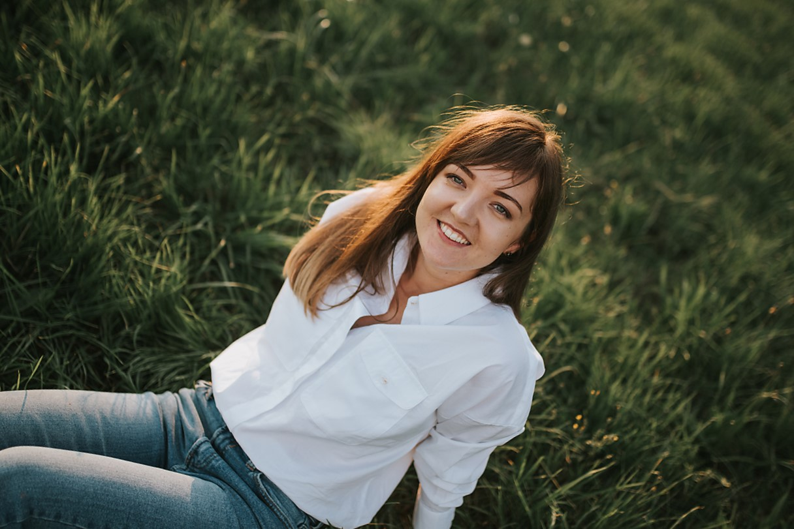

# Maryna Yabluchanska


## Contacts

- **Location**: Kraków, Poland
- **Email**: marina.iabluchanskaya@gmail.com
- **Telegram**: @mYabluchanskaya
- **[LinkedIn](https://www.linkedin.com/in/marina-yabluchanskaya-04366a134/)**
- **Discord**: @Maryna#5171

## About Me

I've been working as markup developer for some time, now I'm in progress of improving my knowledge and skills to become an experienced React Front-end developer.

## Skills

- HTML5, CSS3, 
- SASS
- Responsive Web Design, Cross-browser Compatibility
- Git
- VS Code
- Adobe Photoshop

## Work Experience

- **W3 Ukraine**, Markup developer, 2011 - 2013

- **Freelance**, Freelance markup developer, 2014-2018

- **Pragmatic Coders**, Junior Front-end developer, 2018-2020

- **Freelance**, Freelance markup developer, 2018-2022


## Education

- **Kharkiv State Academy of Railway Transport**
  Master's degree.

  Specialty: “International economic activity“
- **freecodecamp** Front End Development Libraries
- **codecademy** Front-End Engineer
- **pluralsight** React 17: Getting Started

## Code Example


```
function oddOrEven(array) {
    var sum = array.reduce(function (a, b) {
        return a + b;
    },0);
    if(sum%2==0){
      return 'even';
       
       }
    else{
       return 'odd';
    }

}
```

## Languages

- English - Fluent
- Polish - Fluent
- Russian - Native
- Ukranian - Native